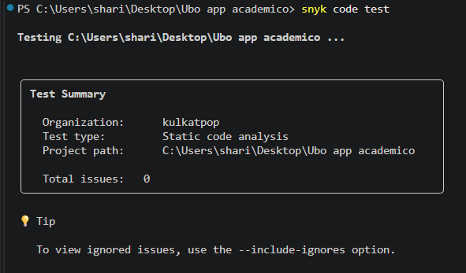

# Análisis SAST con Snyk Code

## 1. Descripción de la herramienta

Snyk Code es una herramienta de análisis estático de seguridad (SAST) que permite detectar vulnerabilidades dentro del código fuente utilizando análisis automatizado basado en inteligencia artificial.

La herramienta está orientada a integrarse dentro del ciclo DevSecOps, permitiendo identificar problemas de seguridad durante el desarrollo antes de llegar a producción.

---

# 2. Configuración utilizada

Proyecto analizado:

UBO-Academic-Hub

Repositorio:

https://github.com/KulkatPOP/UBO-Academic-Hub

Plataforma:

Snyk Code CLI

Método de integración:

Análisis local mediante Snyk CLI ejecutado desde la terminal de Visual Studio Code sobre el repositorio del proyecto.

Lenguaje analizado:

JavaScript / HTML / CSS

Fecha de análisis:

04/09/2026

---

# 3. Configuración del análisis

Proceso realizado:

1. Instalación de Snyk CLI mediante npm.

2. Autenticación del usuario mediante el comando:

snyk auth

3. Ubicación del proyecto en la terminal de Visual Studio Code.

4. Ejecución del análisis SAST mediante:

snyk code test

5. Revisión de resultados obtenidos.
---

# 4. Resultados obtenidos

El análisis realizado mediante Snyk Code finalizó correctamente utilizando análisis estático sobre el código fuente del proyecto.

Resultados del análisis:

- Tipo de prueba: Static Code Analysis (SAST)
- Organización utilizada: kulkatpop
- Proyecto analizado:
  UBO-Academic-Hub

Vulnerabilidades encontradas:

0 problemas detectados.

Nivel de severidad:

No aplica, debido a que no se encontraron vulnerabilidades.

Resultado:

Snyk Code no identificó problemas de seguridad dentro del código analizado.

Análisis:

El resultado indica que el proyecto no contiene patrones de vulnerabilidad conocidos dentro del alcance de las reglas utilizadas por Snyk Code.

---

# 5. Evidencia

Captura del análisis:

---

# 6. Conclusión

Snyk Code permitió realizar un análisis estático de seguridad (SAST) sobre el código fuente del proyecto mediante su herramienta CLI.

El análisis no detectó vulnerabilidades dentro del código evaluado, demostrando que el proyecto no presenta patrones inseguros conocidos bajo las reglas utilizadas por Snyk.

La herramienta permite incorporar controles de seguridad dentro del ciclo DevSecOps, ayudando a detectar problemas antes del despliegue de una aplicación.

